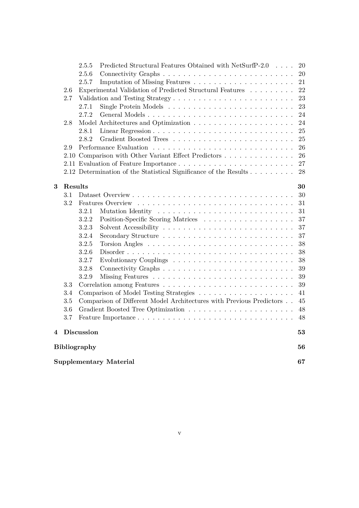
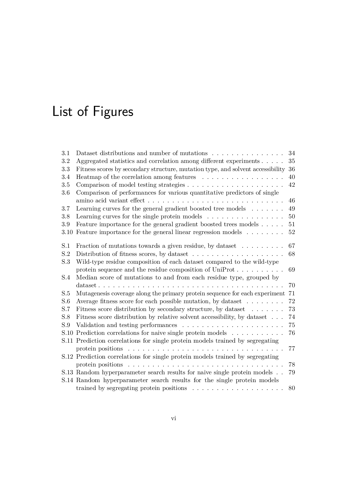
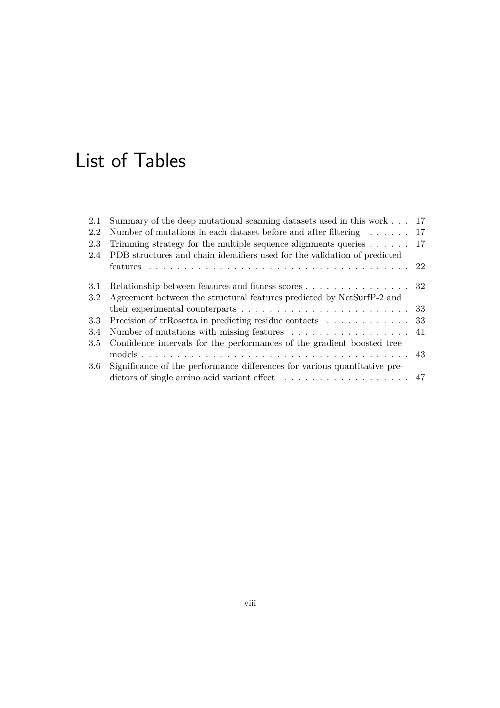
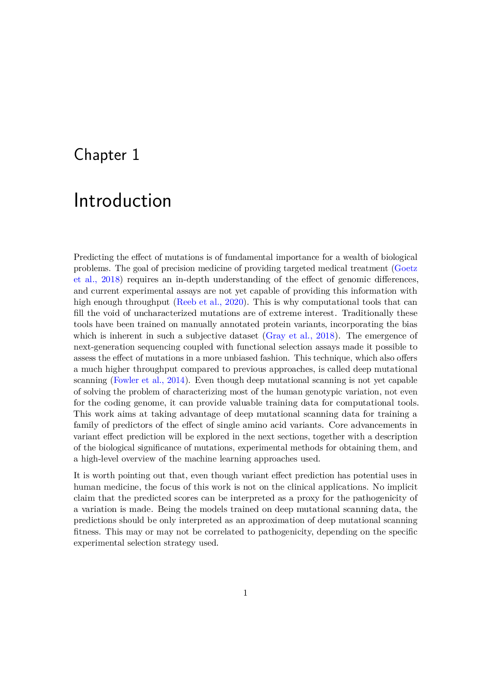

# Prediction of the effect of single amino acid protein variants using deep mutational scanning data

The work contained in this repository was done as part of my master thesis for the bioinformatics master degree at the University of Bologna.

---

## Abstract

Knowledge of the effect of mutations is crucial for improving our understanding of protein function.
Moreover, the rapid increase in the availability of genomic data poses the challenge of linking uncharacterised genetic variants to phenotypes.
Deep mutational scanning is an experimental mutagenesis technique that leverages the use of next-generation sequencing for the assessment of the effect of mutations.
This approach is high-throughput compared to site-directed mutagenesis, but still, it is not sufficient for the characterization of the mutational landscape of the known proteomes.
As a consequence, computational tools for the prediction of the effect of mutations are a valuable resource.
In this work, I present a series of supervised regression models for the prediction of the quantitative effect of mutations trained on deep mutational scanning data.
My models, despite not requiring structural information, perform similarly to Envision, a predictor that uses structural features.
I compare gradient boosted trees and linear regression models, and I also explore several validation and testing strategies.

---

## License

The software of my creation in this repository is licensed under the terms of the MIT license.
Some of the images used in the presentation (`presentation_sources/images`) are not my own creations and are licensed under different terms.
Refer to the file `presentation_sources/images/LICENSE` for more detailed information for each image.
Images of my own creation in the folder `presentation_sources/images` are licensed under the terms of CC BY 4.0 https://creativecommons.org/licenses/by/4.0/ . unless otherwise stated.
Data files in the folder `dataset/`, `hyperparameter_search/` and `processing/` contain factual information and are not subjected to copyright.
Files in the folder `presentation_sources/` and `manuscript_sources/`, as well as the files `master_thesis_manuscript.pdf` and `master_thesis_presentation.pdf` are licensed under CC BY 4.0 https://creativecommons.org/licenses/by/4.0/.

